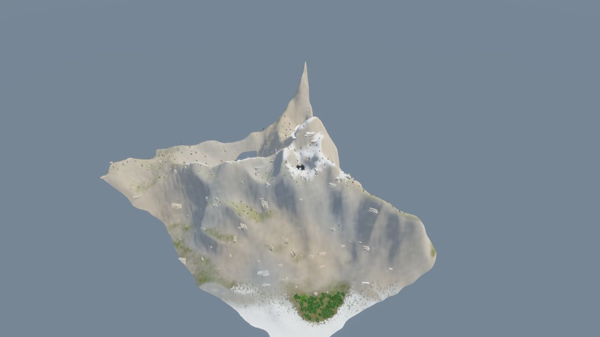

# Alpine lighting and depth correction

The underground-lighting classifier was also applied to the exterior terrain
that generated its coarse height samples. Taking five local minimum samples
still does not guarantee that their bilinear interpolation stays below every
valley. A seed-21 diagnostic at X=-4862, Z=18512 found the interpolated ceiling
about 4.4 m above the real surface. That removes both sun and sky lighting from
exposed ground and creates black pools.

Procedural terrain and its surface rocks now use an explicitly exterior entry
point into the same PBR implementation. Native cave meshes continue to use the
underground classifier. Ordinary sun and point-light shadows remain enabled.
This avoids adding more height samples, background jobs, textures or render passes.

The custom vertex output is also invariant between separately compiled color
and depth programs, and the finite world camera's depth pass now uses the same
radial cutoff as color. Native point/directional shadow views retain offscreen
casters. These changes address depth/color disagreement that can expose dark
background triangles, especially at large coordinates. The invariance guarantee
is defined by the [WGSL specification](https://www.w3.org/TR/WGSL/#invariant-attr).

## Validation

- `cargo build --release` and formatting validation passed.
- 26 rendering tests passed, including an actual shader-guard check for color,
  camera depth and shadow views.
- The graphics smoke passed after fixing its restart to use the requested test
  binary. It covers AA changes, reduced resolution, and restart.
- Reproducible alpine fixture: `bash tools/smoke_lighting_terrain.sh`.
  Seed 21, eye (-4984, 500, 18280), 496 m render / 205 m detail distance.
- Additional mountainous captures were taken around X=-4993, Z=18272.9 with seed
  721. The screenshot world's random seed was unavailable, so these are
  deterministic regression scenes rather than recreations of that exact world.

Do not increase ambient intensity to hide these failures: that washes out caves
and does not correct the receiver classification or depth contract.

The matched seed-21 capture confirms removal of the black pool below the snowy
ridge. The native cave smoke also passed and accepted pause input.

The final full-LTO release passed the same mountain fixture at a 3840×2160
world render target with high shadows, with no shader errors. The 1280×720
presentation capture is supersampled; windowed FPS is not a performance claim.
The exact large polygon from the user's random world was not reproduced, so
its specific cause remains unconfirmed despite the depth-contract corrections.
