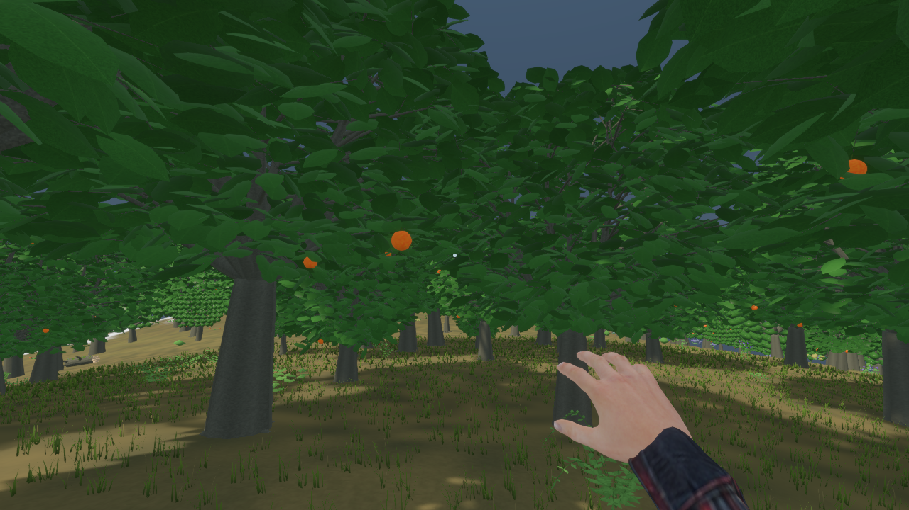
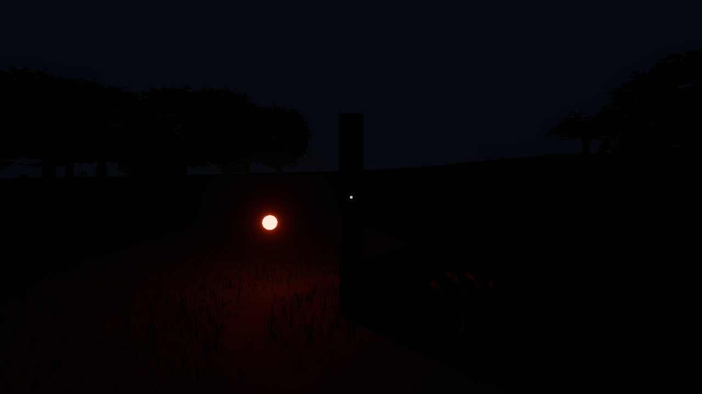
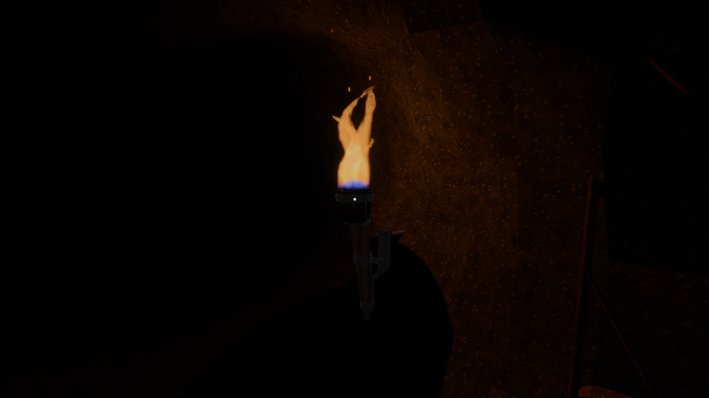

# Lighting validation — 7 September 2026

This records checks for the shared PBR/item-emission implementation. The API,
ownership rules and rendering limits are in [LIGHTING.md](LIGHTING.md).

## Automated and native checks

- `cargo build --release` passed with the project’s full LTO and optimization settings.
- Rendering tests: 25 passed, including emitter lifecycle, shared-material
  isolation/restoration, finite photometric values, serialization defaults,
  immediate disable and the shared shadow budget.
- Torch animation/pause test: 1 passed. Hand animation tests: 2 passed.
- `cargo check --tests` passed during implementation.
- Native graphics smoke passed, cycling AA modes, render resolution, coordinates
  and grass. This exercises WGSL specialization that Rust compilation cannot check.
- Generic glowing item, isolated dark wall/light fixture, 128-candidate stress
  scene, forest, generated goblin den interior and close torch view rendered
  without shader errors. The den accepted pause input.
- Strict repository-wide Clippy remains blocked by existing errors, including
  unused orchard code and unrelated style findings. Its log is retained in
  `tools/build/lighting/clippy-final.log`; this is not a claim of a clean full suite.

Targeted tests used the release dependency graph with debug assertions and
integer overflow checks enabled. Development visual checks used an optimized
QA binary without full LTO; their frame rates are not benchmark evidence.

## Reproduction

```sh
cargo build --release
bash tools/smoke_lighting.sh dark
bash tools/smoke_lighting.sh stress
bash tools/smoke_graphics.sh
HITHER_GOBLIN_DEN_PREVIEW=interior bash tools/smoke_lighting.sh den
python3 tools/benchmark_render.py --binary target/release/hither-sdf \
  --asset-root . --output tools/build/lighting/zero \
  --cases lighting --resolution 10 --shadow-quality medium --light-count 0
python3 tools/benchmark_render.py --binary target/release/hither-sdf \
  --asset-root . --output tools/build/lighting/128 \
  --cases lighting --resolution 10 --shadow-quality medium --light-count 128
```

The fixtures use isolated settings and Xvfb. They do not modify player settings.
Seed 721 contains the generated den used for review. `HITHER_LIGHTING_TEST` is
opt-in and absent in ordinary play. The dedicated test fixture can spawn up to
512 emitters; testing the 128-emitter case is not evidence for every arrangement
of 512 lights or casters.

Benchmark resolution 10 selects a 2560 × 1440 world target; the offscreen
presentation target remains 1280 × 720. The harness waits for competing game or
compiler processes and retries contaminated runs. Fixture comparisons include
the inexpensive bulb/wall geometry as well as lighting and report whole-frame
times, not isolated GPU lighting-pass timings.

## Remaining qualification

The environment field is directional sky ambient plus a terrain-ceiling mask.
It does not bake room bounce, trace moving-light GI, or resolve room partitions
in its coarse interpolation. Detailed direct-light occlusion uses native shadow
maps. The small ambient floor keeps unlit interiors readable. No 2 ms lighting
budget, universal FPS target, or performance on lower-end GPUs is claimed.

## Forest release comparison

Hardware: RTX 5090 (32 GB), NVIDIA driver 580.173.02, Intel i9-14900KS,
Rust 1.97.1. Captured pre-change release executable/assets versus the final
full-LTO release, seed 721, FXAA, high shadows, 260 m render distance, 35 m detail
distance, 1440p world target. Order: before, after, after, before. Each run warms
for 20 seconds, then samples stationary and moving phases.

| Build/run | Stationary median / p95 / p99 (ms) | Moving median / p95 / p99 (ms) |
| --- | --- | --- |
| Before 1 | 3.53 / 4.13 / 4.48 | 4.93 / 9.97 / 81.38 |
| After 1 | 3.60 / 4.26 / 4.52 | 5.43 / 10.49 / 48.84 |
| After 2 | 3.71 / 4.49 / 4.94 | 5.35 / 10.13 / 43.03 |
| Before 2 | 3.84 / 4.63 / 5.08 | 5.35 / 10.06 / 64.56 |

The average of the two per-run stationary medians is 3.685 → 3.655 ms; moving
medians average 5.14 → 5.39 ms (+4.9%). Stationary p95 averages 4.38 → 4.375 ms;
moving p95 averages 10.015 → 10.31 ms (+2.9%). These averages are descriptive,
not pooled frame percentiles or statistical confidence intervals. Streaming and
visibility workload vary between runs, so these whole-scene measurements do not
isolate shader cost or prove a universal 5% regression ceiling. Raw settings and
logs are retained under `tools/build/lighting/benchmark-{before,before-repeat,after}`.

## Fixed-view emitter stress

One clean pair on the same hardware and final release binary, seed 721, 1440p,
FXAA, medium shadows (two point-shadow slots, 1024-pixel faces), 48 m render and
24 m detail distance. Both phases keep speed at zero, so the second phase is
another stationary sample despite the profiler's historical "moving" label.

| Candidates | First median / p95 / p99 (ms) | Second median / p95 / p99 (ms) |
| --- | --- | --- |
| 0 | 2.43 / 3.12 / 3.53 | 2.47 / 3.23 / 3.52 |
| 128 | 5.01 / 6.60 / 7.00 | 4.92 / 6.26 / 6.95 |

The first median increased by 2.58 ms. Only two shadowed direct lights are
admitted; the remaining luminous meshes stay visible. This exercises budget
suppression, not 128 simultaneously shadowed lights. The cost includes native
point-shadow rendering, the luminous meshes and a test wall. It does not verify
the proposal's provisional 2 ms **GPU-only** lighting target. Raw results are in
`tools/build/lighting/benchmark-zero` and `tools/build/lighting/benchmark-128`.

## Final release captures

The forest and direct-light occlusion fixtures were rerun with the final release
binary after the clean benchmarks. Their windowed frame rates are presentation
limited and are not used in the performance comparison.



The isolated fixture removes sun, sky irradiance and ambient. The emitter lights
the ground beside the wall while the wall blocks its direct contribution.



The final release also passed the close torch fixture. The flame uses one moving
emitter, with warm light and shadow on the adjacent room surface.


