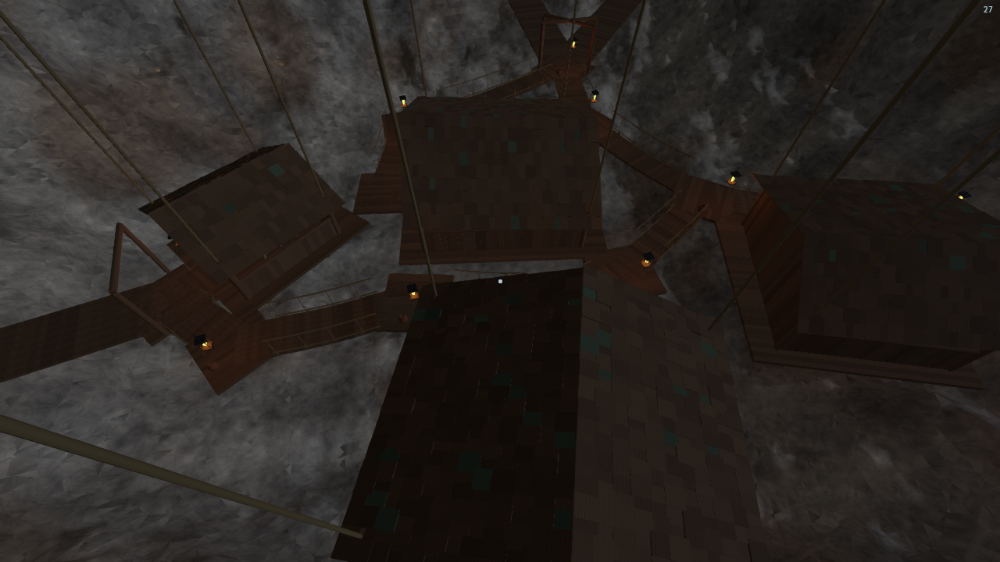
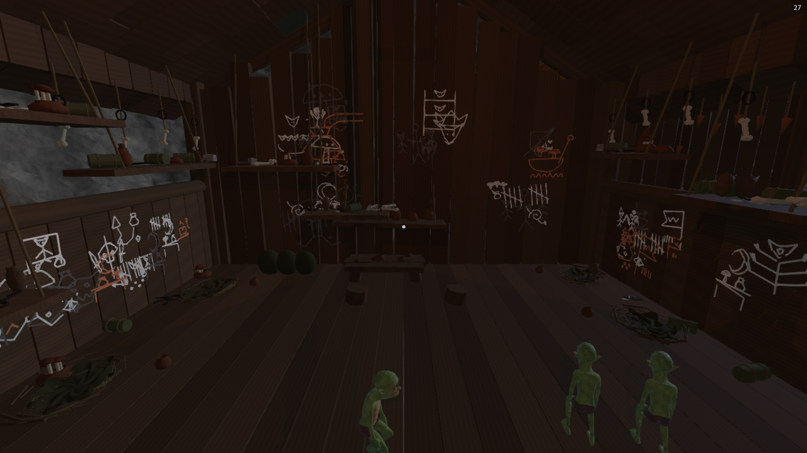
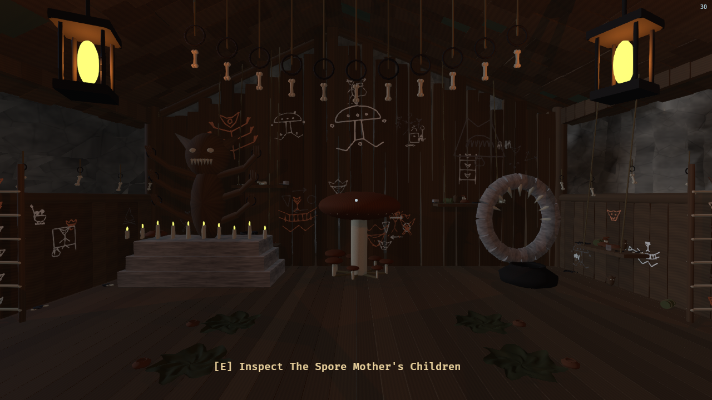
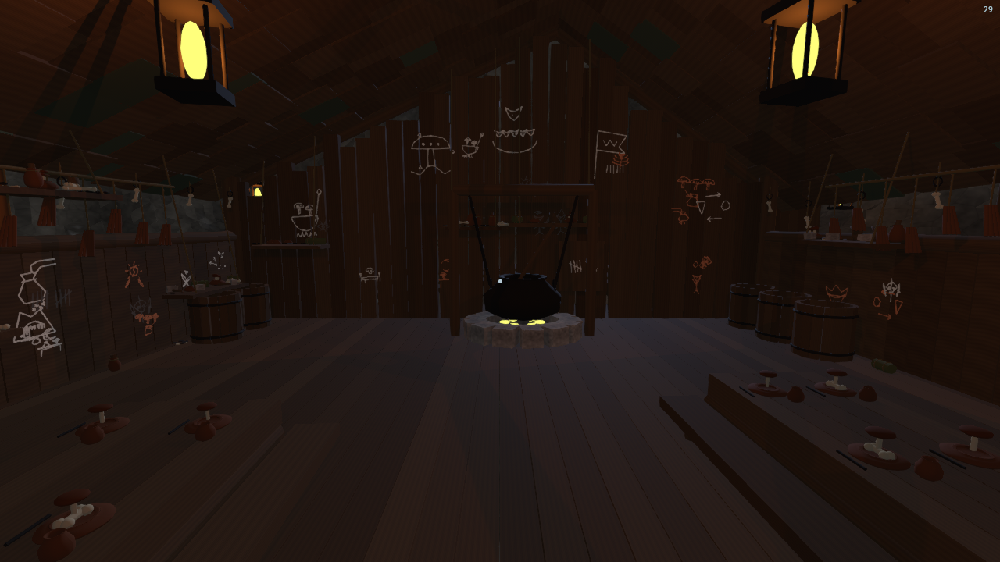
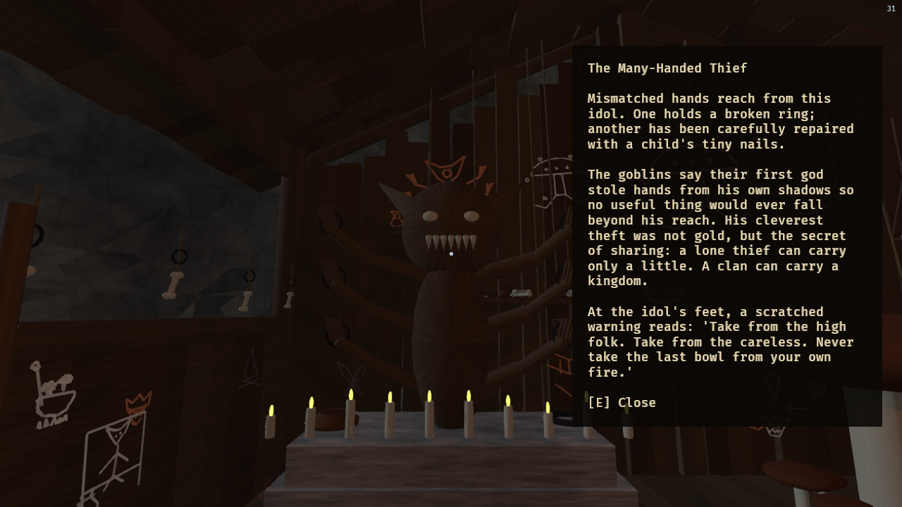
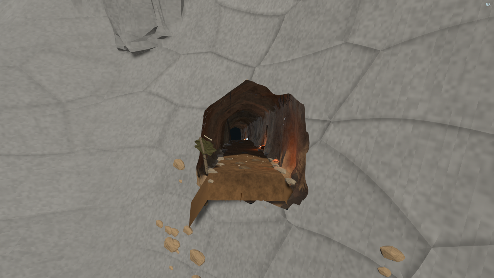
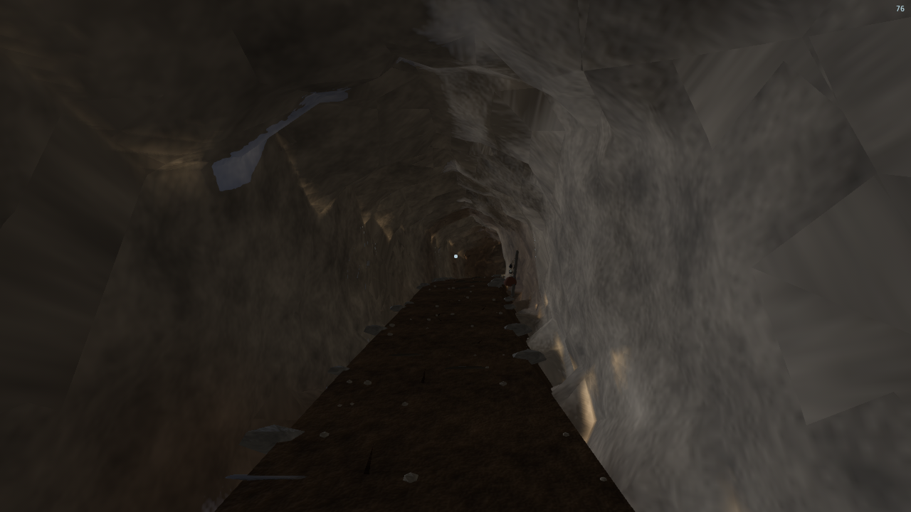
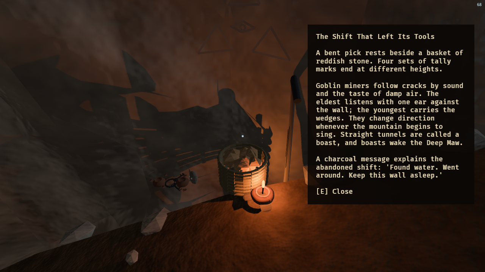
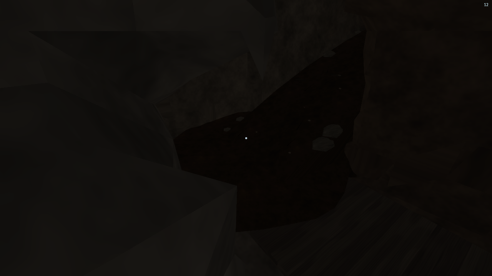

# Goblin mountain dens

Goblin settlements use the oak's 288 m region size and 25% regional placement
roll, with an independent seed salt. Habitat filtering additionally requires a
mountain weight of at least 0.85, a summit at least 175 m high, and a surveyed rock
cover of at least 16 m above the entire irregular chamber. The chamber center is
62–75 m below the refined crest. This is the same *placement rate* as oak trees;
the realized number depends on the available suitable mountain habitat.

Each seed generates fresh dimensions, house positions, bridge sag, entrance
bearings, passage curves, furnishings and art. There is no den prefab or variant
index. A misshapen ellipsoidal chamber is unioned with 1–3 passages (50% one, 25% two, 25% three) using sparse
marching tetrahedra. Passages climb around the mountain interior to high surface
mouths; routes that leave the mountain prematurely, cross a house, or intersect
another passage are rejected.
Terrain and rock rendering cut away the matching mouth excavation profiles in both the main
and depth prepasses. The shell is clipped against the terrain at the opening.

There are 2–5 houses, four goblins per house, and four goblin-sized hide-and-straw nests
per house. Normal gameplay spawns goblins only as den residents; there is no independent surface population. Free-placed
houses, landings and rope bridges form a connected network. The joinery includes individual
floorboards, overlapping roof shakes, braces, suspension ropes attached to the
cavern roof, nail heads, lashings, open doorways and windows. Interiors include
ragged creased hides, individual straw fibers and twigs, low split-slab tables,
stump seats, tied sacks, rope-slung shelves, hollow pottery, claw-mark art,
dangling tooth charms and lanterns. Nest dimensions and furniture heights derive
from the actual goblin stature. Each house also has 4–9 scattered salvage shelves,
open slatted bins, bottles, keys, game counters, mushrooms, carved fetishes,
bone bundles, knives, mallets and broken vessels. Layered pigment ribbons form
fang-filled faces, hunting sketches, palm prints, tally groups and tunnel maps.
Dressing uses the den seed and keeps the main routes and resident spawns clear. Roofs are lopsided and repaired with irregular
shakes; reclaimed wall planks have unequal lengths and crooked joinery. Ten batched material meshes use
procedural grain, woven fibers, mineral pores, throwing marks and rough metal.
The rock shell uses bounded multiscale noise for actual relief, world-space
iron/mineral/damp color variation, and seamless granular stone textures with fine mineral pores. Neutral reflected lighting replaces the blue fill. The terrain opening uses the
same rough excavation field as the cave wall, with a narrow rock overlap at the
mesh seam. Inward views through a mouth fade into underground darkness.

Collision and navigation use triangle BVHs built from the rendered rock and
structural surfaces, including sloping bridge boards and tunnel decking. House
residents spawn in clear spaces between the nests. Mesh construction and upload
preparation run on the async compute pool. Geometry is released on stream-out;
placement caches are bounded. A maximum of four nearby lanterns cast shadow maps.

## Verification

```sh
cargo test --offline goblin_dens -- --nocapture
cargo build --offline --release
HITHER_WORLD_SEED=721 HITHER_GOBLIN_DEN_PREVIEW=1 target/release/hither-sdf
bash tools/smoke_goblin_dens.sh
```

The opt-in preview starts in spectator mode inside a naturally generated den;
normal launches still start at the castle. Tests cover deterministic placement,
mountain cover, population counts, surface connections, gradients, resident
clearance and continuous bridge support against actual rendered triangles.
Variation tests compare distinct layouts across four seeds and require exact
repeatability, clear routes and connectivity for each one. The raw-excavation
revision passes all 17 goblin checks, including passage clearance and closed
underground roofs. In-game visual checks cover the cavern, home, worship house,
food hall, mountain entrance, tunnel and the opened lore panel.

## In-game views





## Goblin wall culture

The drawing vocabulary has 36 subjects. Each house includes theft, conflict,
and faith, plus random everyday stories. Pigment, tilt, proportions, mirroring,
stroke irregularity, object counts and overlapping smaller marks vary with the
seed. These are generated strokes, not image decals or house-layout variants.

* Taking and cunning: lifted purses, broken locks, window thieves, fleeing raiders,
  stolen crowns, hidden hoard maps, false tracks and stolen fire.
* Conflict: crossed blades, pierced shields, ambushes, clan duels, spear trophies,
  bitten war banners and a defeated surface sun.
* Den faith (new fictional folklore): the **Many-Handed Thief** blesses cunning;
  the **Deep Maw** receives stolen offerings beneath the mountain; the
  **Spore Mother** represents underground life and regrowth. Ancestor ladders,
  moon offerings, blind-eye wards, shaman dances and burial vigils accompany them.
* Daily life: mushroom harvests, communal feasts, bridge-building, teeth-for-coins
  barter, pet tunnel rats, brood nests, clan knots and rockfall warnings.

A house contains 35–80 primary drawings, with additional small companion symbols
combined into overlapping stories. Placement, density and composition are sampled
across the available wall space, rather than aligned into rows.

## Worship and the communal food hall

Every den additionally generates a house of worship and a food hall. They are
packed into free cavern space along with the homes, with no assigned gaps, rings,
or central plaza. Bridge routes come from a visibility graph around actual room
bounds; unused corner waypoints are removed and optional loops vary by seed.
These buildings do not replace the minimum two homes or their four residents each.

The worship house includes a many-armed carved idol with finger joints and stolen
rings, a tooth-lined Deep Maw altar, a gilled Spore Mother idol, root shrines,
ancestor ladders, offering bowls, wax-dripped candles, prayer hides and hanging
reliquaries. The food hall includes individually sized and positioned communal trestle tables, varying place
settings, bowls and utensils, drying lines, staved provision barrels, tied knives,
a repaired iron cauldron, chain suspension, embers and a cook's record board.

Aim at a relic or record within reach and press **E** to inspect it; **E** closes
the reading panel. Twelve discoverable passages explain the gods, ancestor rites,
moon offerings, the founder's first theft, meal truces, famine, missing travelers
and brood stores. The picker respects walls, range, pause and chat input.

Additional visual checks:

```sh
HITHER_GOBLIN_DEN_PREVIEW=shrine bash tools/smoke_goblin_dens.sh
HITHER_GOBLIN_DEN_PREVIEW=food-hall bash tools/smoke_goblin_dens.sh
HITHER_GOBLIN_DEN_PREVIEW=shrine-relic HITHER_DEN_INSPECT=1 bash tools/smoke_goblin_dens.sh
```







## Generation rules

The world seed and region coordinates determine one stable den. Revisiting it
reproduces that den; different sites receive independent geometry and layouts.
Buildings use rejection sampling with rock-cover and overlap constraints, random
bearings, proportions and floor elevations. Roof height, ridge offset, slope,
window proportions and unequal platform overhangs are continuous parameters.
There is no numbered room or den variant catalogue.

Nests occupy sampled free wall bands. Shelves vary in position, height, length
and contents. Shrines shuffle their ritual stations and vary idol construction;
food halls pack differently sized tables and generate their place settings.
The shared cultural symbols remain recognizable, with seeded strokes,
proportions, pigment, orientation and accompanying marks. Functional constraints
retain the required homes, residents, communal buildings and traversable routes.


## Raw excavations and mountain entrances

Tunnel-count selection uses 50% one, 25% two and 25% three, after validating the
same three-route candidate pool for every site. Rejected routes therefore cannot
favor one-tunnel settlements. Unequal control-point turns, radial offsets and
changing grades replace the uniform spiral.

The goblin reference drives an aggressive, improvised burrow rather than a
maintained mine. Unequal hacked wall planes, low shoulders, broken roof profiles
and granular rock replace the circular pipe and regular wall pattern. The terrain
portal shader uses the same excavation field as the rendered cave to close the
mountain seam. Inward views fade into underground darkness.

The cavern approach remains a hanging bridge. Excavated passages have packed
brown earth, drag furrows, scattered grit, pick scars and occasional wet smears.
Their irregular banks spread down into the cave floor; the tread stays narrow
enough to clear tight bends. Shared cross-sections and normals keep the dirt surface continuous through
bends, with a narrow walking channel and rough sloping banks. World-space grain
continues across the surface, and the mouth ends in a short slumped lip. There are no paving stones,
fitted edging, repeated support arches or orderly rows of lanterns. A few crooked
props meet the actual roof, with rough fibers, splits and scraps of lashing.
Small grease bowls and soot provide irregular pools of light.

The entrance is a raw wound in the mountain, with thrown-out spoil, exposed roots,
a stolen hide on a crooked stake, bone warnings and hasty charcoal marks. There
is no masonry doorway. Deeper pockets contain tangled scrap alarms, abandoned
picks and ore baskets, miners' memorials and homecoming caches. Four additional
inspectable stories explain warning signals, mining taboos, remembered casualties
and the rule of counting companions before spoils. Each passage contains these
four records, in addition to the twelve within the den buildings.

```sh
HITHER_GOBLIN_DEN_PREVIEW=entrance bash tools/smoke_goblin_dens.sh
HITHER_GOBLIN_DEN_PREVIEW=tunnel bash tools/smoke_goblin_dens.sh
HITHER_GOBLIN_DEN_PREVIEW=tunnel-relic HITHER_DEN_INSPECT=1 bash tools/smoke_goblin_dens.sh
```







## Tunnel-to-bridge landings

At the cavern end of each tunnel, a graded earth apron fills the full turn between
its outgoing floor and the differently oriented bridge deck. Heights blend from
the two actual routes. An irregular closed rock buttress supports the apron and
covers the formerly exposed ends of the dirt banks. The bridge ends inside this
landing rather than merely touching the tunnel's center point.

The corner regression sweeps the landing perimeter across three world seeds;
the existing route tests also check player clearance through the transition.
All 18 goblin checks pass, and the junction preview passes the in-game render
check.
Preview with `HITHER_GOBLIN_DEN_PREVIEW=tunnel-junction`.


